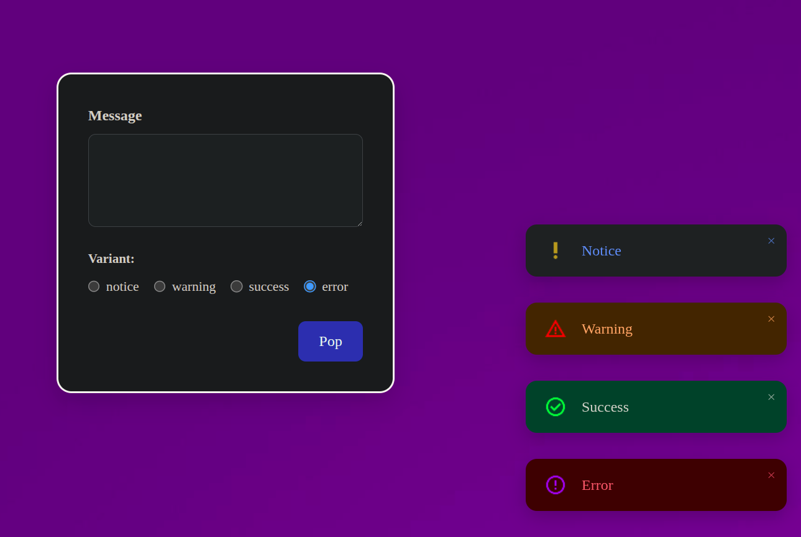

# Toast Notification System in React

## 🚀 Live Demo

👉 [Click here to try it live](https://mknishanth1997.github.io/pop)



A modular, reusable Toast notification system built using **React Context API**, perfect for displaying temporary messages like success alerts, warnings, errors, and notices. Designed with a clean component structure and contextual state management.

---

## 📋 Table of Contents

- [Features](#-features)
- [Folder Structure](#-folder-structure)
- [Core Technologies](#-core-technologies)
- [Architecture](#-architecture)
- [How It Works](#-how-it-works)
- [Usage Example](#-usage-example)
- [Run Locally](#-run-locally)
- [TODO / Improvements](#-todo--improvements)
- [Author](#-author)

---

## ✨ Features

- 🔄 Dynamically show multiple toasts
- 🎨 Four variants: **success**, **error**, **warning**, **notice**
- 🧹 Auto-dismiss or manual close
- 🎨 Each variant has its own icon, background, and color
- 💅 Responsive and styled using custom CSS (no frameworks)

---

## 📁 Folder Structure

src/
├── App.jsx
├── assets/ # Icons for toast types
├── Context-Api/
│ └── ToastProvider.jsx # Context logic + Toast UI
├── Form/
│ └── Pop-page/
│ └── Pop-page.jsx # User form to trigger toast
├── Toast/
│ └── Toast.jsx # Toast component
│ └── Toast.css # Toast styles

---

## ⚙️ Core Technologies

- ✅ **React 18+**
- ✅ **Context API** for global state
- ✅ **Functional Components**
- ✅ Clean separation of concerns
- ✅ Scoped CSS (no libraries, pure CSS)

---

## 🧠 Architecture

1. **ToastProvider**
   - Wraps the app and holds the global toast state.
   - Exposes `addToast` and `removeToast` via context.

2. **Pop-page**
   - A form that accepts input + variant selection.
   - Calls `addToast()` on submit.

3. **Toast**
   - Pure presentation component.
   - Receives `variant`, `children`, and `onClose` props.
   - Pulls icon/colors based on the variant.

---

## 📝 How It Works

1. User fills out a message and selects a variant in the form.
2. On submit, `addToast(message, variant)` is called.
3. The toast is added to a state array in `ToastProvider`.
4. Toast UI renders all active toasts.
5. Each toast auto-dismisses or can be closed manually.

---

## 🧪 Usage Example

```jsx
const { addToast } = useToast();

<form
  onSubmit={e => {
    e.preventDefault();
    addToast('Task saved!', 'success');
  }}
></form>;
```

# ✅ TODO / Improvements

- ⏳ Add auto-dismiss timer

- 🧼 Add animation using Framer Motion

- 🔁 Add queue logic to limit max toasts on screen

- ⚙️ Optional support for position (top-left, bottom-right, etc.)

🧑‍💻 Author
Built with 💻 by Nishanth MK
If you found this project useful, please give it a ⭐ and use it in your own projects!
